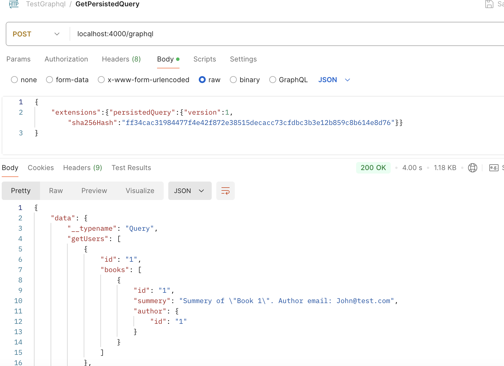

# graphql
GraphQL — це мова запитів для API та середовище виконання для 
 цих запитів. GraphQL надає повний і зрозумілий опис даних у вашому API, 
дає клієнтам можливість вимагати саме те, що їм потрібно, і нічого більше.
GraphQL був розроблений у великому старому Facebook у 2012 році (2015 open source).
# schema
Схема визначає систему типів. 
Вона описує множину можливих даних. Реквести від клієнта валідуються і виконуються згідно зі схемою. 
Клієнт може знайти інформацію про схему через інтроспекцію (якщо вона увімкнена).
# scalar types
Скалярні типи це прості типи даних, які представляють собою одне значення.
Наприклад:
- Int: A signed 32‐bit integer.
- Float: A signed double-precision floating-point value.
- String: A UTF‐8 character sequence.
- Boolean: true or false.
- ID: The ID scalar type represents a unique identifier, often used to refetch an object or as the key for a cache. The ID type is serialized in the same way as a String; however, defining it as an ID signifies that it is not intended to be human‐readable.

Ми можемо створювати власні скалярні типи, це також допомагає частково валідувати вхідні дані.
Як приклад я додав скаляр DateTime в схему user-service.
```
scalar DateTime
```
# object types
Об'єктні типи складаються з набору полів, кожне з яких може мати свій тип. Наприклад:
```graphql
type User @key(fields: "id") {
    id: ID!
    name: String!
    email: String!
    profile: Profile @hasRole(role: "admin")
    userFeatureFlags: [UserFeatureFlag!]!
    gender: UserGender!
    createdAt: DateTime!
}
```

Також є ряд інших типів:
- **Interface**: Інтерфейси використовуються для описування об'єктів, які мають спільні поля.
- **Union**: Об'єднання використовується для описування об'єктів, які можуть бути одного з декількох можливих типів.
- **Enum**: Перерахування використовується для описування набору можливих значень.
- **Input**: Вхідні типи використовуються для передачі аргументів у запити та мутації.
# directives
Директиви це спеціальні аннотації, які можна додати до схеми, щоб змінити поведінку запитів чи резолверів.
Деякі директиви вбудовані в GraphQL, наприклад @skip та @include, деякі специфічні для федерації.
Також ми можемо створювати власні директиви.
# root types
Основні типи це Query, Mutation та Subscription.
Query використовуємо для наших запитів, Mutation для змін даних, а Subscription для реакції на події.
Приклад query в схемі:
```graphql
type Query @extends {
    getUsers(limit: Int): [User!]!
}
```

Приклад самого запиту:
```graphql
query {
    getUsers {
        id
        email
    }
}
```
Або в іншому варіанті з аргументом:
```graphql
{
    "operationName": "GetUsers",
    "variables": {
        "limit": 2
    },
    "query": "query GetUsers($limit: Int) { getUsers(limit: $limit) { id email createdAt } }"
}
```
Як результат тримаємо список користувачів з їх id та email.
## Анатомія запиту


# resolvers
Резолвери це наший код що використовуюється для виконання запитів.

# Apollo Federation
**Apollo Federation** — це метод масштабування GraphQL, який дозволяє поєднувати декілька GraphQL-сервісів у єдину, злагоджену GraphQL API. Це підхід, який дозволяє розподіляти ваш GraphQL-схеми між декількома сервісами (так званими "сервісами федерації"), зберігаючи при цьому централізовану точку доступу для клієнтів.
Як приклад в тестовому аплікейшині використали Apollo Federation.
Має власні специфічні директиви (@key, @extends, @requires, @shareable,...).
https://www.apollographql.com/docs/graphos/reference/federation/directives
Цікавою альтернативою є GraphQL Mesh.
### Основні переваги та особливості GraphQL Federation:


1. **Децентралізація сервісів**:
 - Кожен сервіс відповідає за частину схеми та логіки, що дозволяє командам працювати незалежно. Кожен сервіс має свою власну GraphQL API, яка потім об’єднується в єдину загальну API.

2. **Gateway**:
 - Основна точка доступу — це спеціальний GraphQL Gateway, який виступає як проксі і об’єднує запити до окремих сервісів.

3. **Розширення типів**:
 - Сервіси можуть розширювати типи з інших сервісів, тобто ви можете мати частини одного типу в різних мікросервісах, але об'єднувати їх через gateway.

4. **Директиви федерації (@key, @extends та інші)**:
 - GraphQL Federation використовує спеціальні директиви, як-от `@key` та `@extends`, для ідентифікації ключів та визначення взаємозв'язків між сервісами. Це допомагає gateway коректно об’єднувати запити та типи.

5. **Оптимізація запитів**:
 - Gateway оптимізує запити, направляючи їх лише до тих сервісів, які потрібні для виконання конкретного запиту. Це допомагає зменшити навантаження та збільшує продуктивність.

## Основні компоненти GraphQL Federation

### 1. GraphQL Gateway
- **Gateway** — це централізована точка доступу для клієнтів. Він отримує запити від клієнтів і динамічно розподіляє їх до відповідних підлеглих сервісів (subgraphs), об'єднуючи відповіді від кожного сервісу.
- Gateway об’єднує схеми від різних сервісів федерації та надає єдину API для клієнтів. Він також виконує оптимізацію запитів, обробляючи лише ті підсхеми, які необхідні для виконання конкретного запиту.

### 2. Subgraphs
- **Subgraphs** — це незалежні GraphQL-сервіси, які є частинами єдиної федеративної архітектури. Кожен сервіс визначає свою частину схеми та відповідає за її виконання.
- Subgraphs можуть містити унікальні типи, поля та операції або розширювати типи, визначені в інших subgraphs.

### 3. Деякі директиви федерації
- **@key**: Визначає основний ключ для типу, за яким він буде ідентифікований та об'єднаний з іншими типами між subgraphs. Це дозволяє сервісам розширювати типи, визначені в інших сервісах.
- **@extends**: Використовується для того, щоб підсервіс міг розширити тип, визначений в іншому сервісі. Subgraph може додати поля або описати взаємозв’язки з іншими типами через цей механізм.
- **@external**: Позначає поля, які існують у схемі іншого сервісу, але використовуються у поточному сервісі.
- **@requires**: Визначає залежність від полів інших типів, щоб отримати повну інформацію для обробки запиту.

### 4. Subgraph Schemas
- Кожен subgraph має свою власну GraphQL-схему, яка визначає його частину загальної API. Ці схеми можуть бути незалежними або мати спільні типи, що розширюються або спільно використовуються іншими сервісами.

### 5. Об'єднання схем (Schema Composition)
Це процес, коли GraphQL Gateway збирає та об'єднує схеми від усіх subgraphs у єдину, централізовану схему. 
В нашому example-app для об'єднання схеми використовується Apollo Gateway (що не підходить для проду).
Також ми можемо створити схему з наших сервісів за допомогою Apollo Rover й в результаті отримаємо `federation-schema.graphql`. 

```docker build -t rover -f ./docker/rover/Dockerfile .```

```docker run -it --rm -v ./:/app rover```

# data loaders
Один з шляхів оптимізації запитів це використання data loaders. Вони вирішують проблему n+1 запиту а саме коли 
GraphQL-запит отримує список об'єктів і пов'язані з ними дані, часто виникає ситуація, коли для кожного запису 
надсилається окремий запит до бази даних або зовнішнього API. Це може призвести до величезної кількості запитів, 
навіть якщо дані можна було б отримати одним або кількома запитами. Наприклад, є запит: 
```graphql
query {
    books { author {name}}
}
```
Припустімо, що у вас є 10 книг. 
У кожної книги є автор, виходить що спочатку ми зробимо один запит для отримання 
всіх книг, а потім для кожної книги резолвер в user-service зробить окремий запит для отримання її автора. 
Це призведе до 1 запиту для книг і 10 запитів для авторів, замість того, 
щоб отримати всіх авторів для всіх книг за один запит. 
# persisted queries
Persisted queries — це техніка оптимізації GraphQL-запитів, яка зберігає запити на сервері або клієнті, 
щоб зменшити обсяг трафіку та підвищити безпеку API.
Запити GraphQL створюються під час розробки, а потім зберігаються на сервері або клієнті (це можна дозволити робити й клієнту). 
Кожному запиту присвоюється унікальний хеш, який буде аліасом.
Також це може стати інструментом безпеки, оскільки сервер виконує лише запити, 
які були попередньо збережені і схвалені, це запобігає виконанню непередбачених або шкідливих запитів. 
Це знижує ризик атаки через підроблені або несанкціоновані запити.

Робимо запит з використанням хеша.


# depth limit


# libraries
https://graphql.org/community/tools-and-libraries/


# links
https://www.apollographql.com/docs/federation/federated-schemas/composition
https://www.apollographql.com/docs/rover/commands/supergraphs/#yaml-configuration-file
https://www.apollographql.com/blog/9-ways-to-secure-your-graphql-api-security-checklist
https://github.com/apollographql/router
https://www.apollographql.com/docs/technotes/TN0021-graph-security/
https://www.apollographql.com/docs/router/
https://www.apollographql.com/docs/apollo-server/performance/apq/
https://gqlgen.com/reference/dataloaders/
https://evgeniy21.medium.com/%D0%B0%D0%BD%D0%B0%D1%82%D0%BE%D0%BC%D0%B8%D1%8F-%D0%B7%D0%B0%D0%BF%D1%80%D0%BE%D1%81%D0%B0-graphql-58e3aca51684
